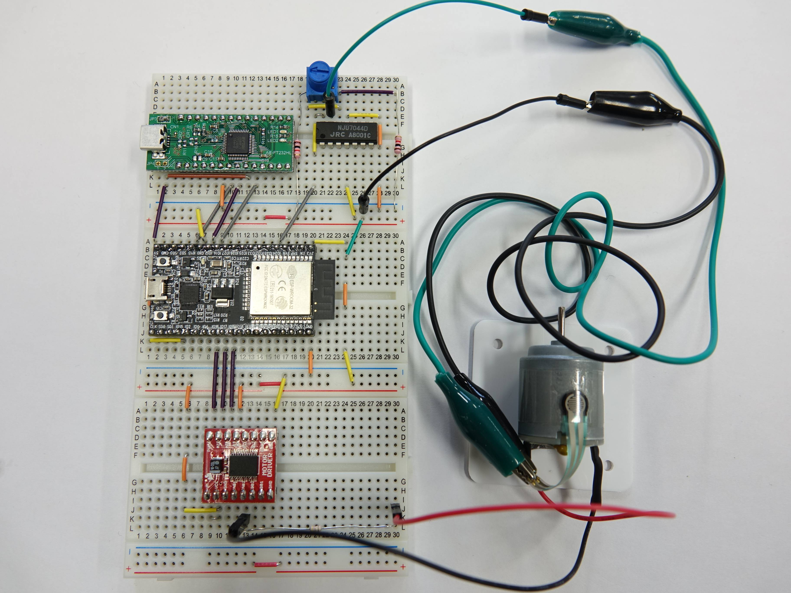
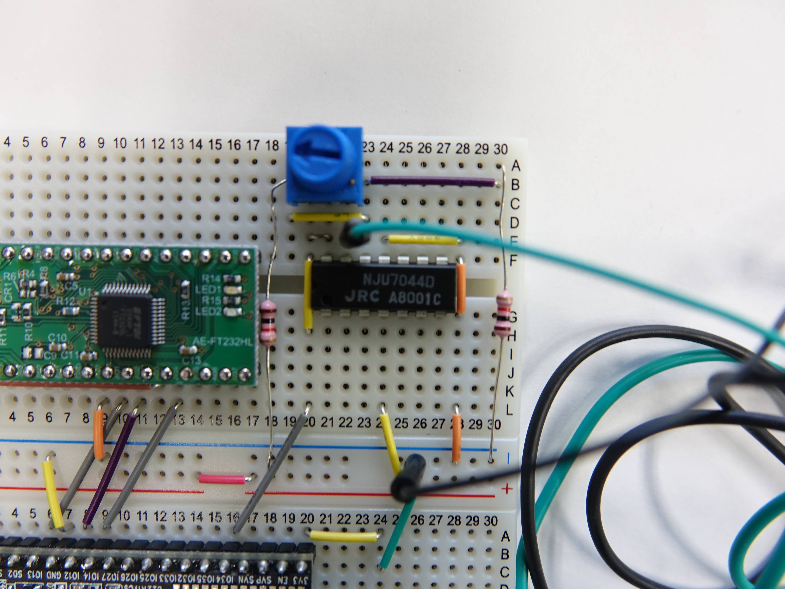
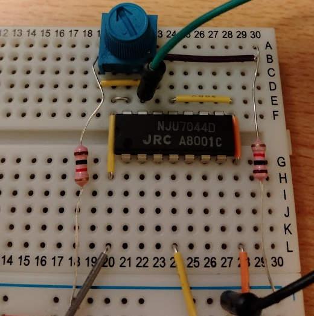
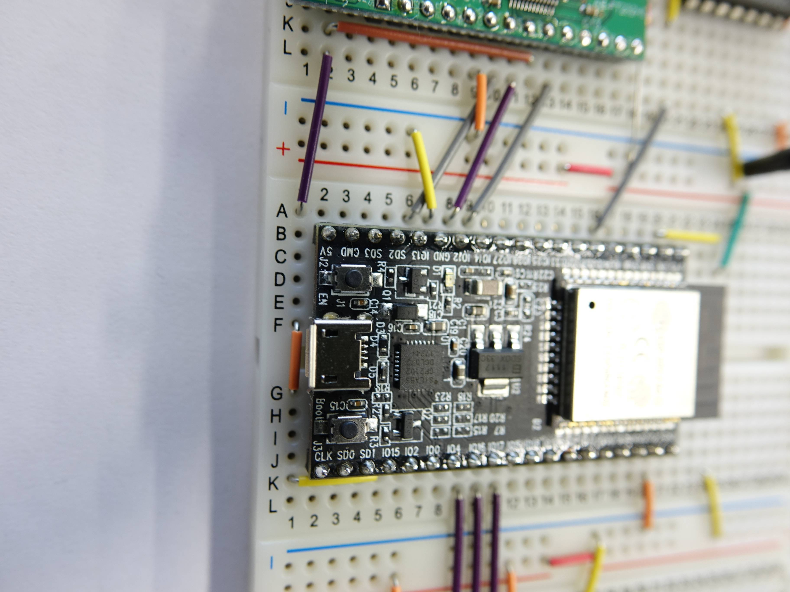
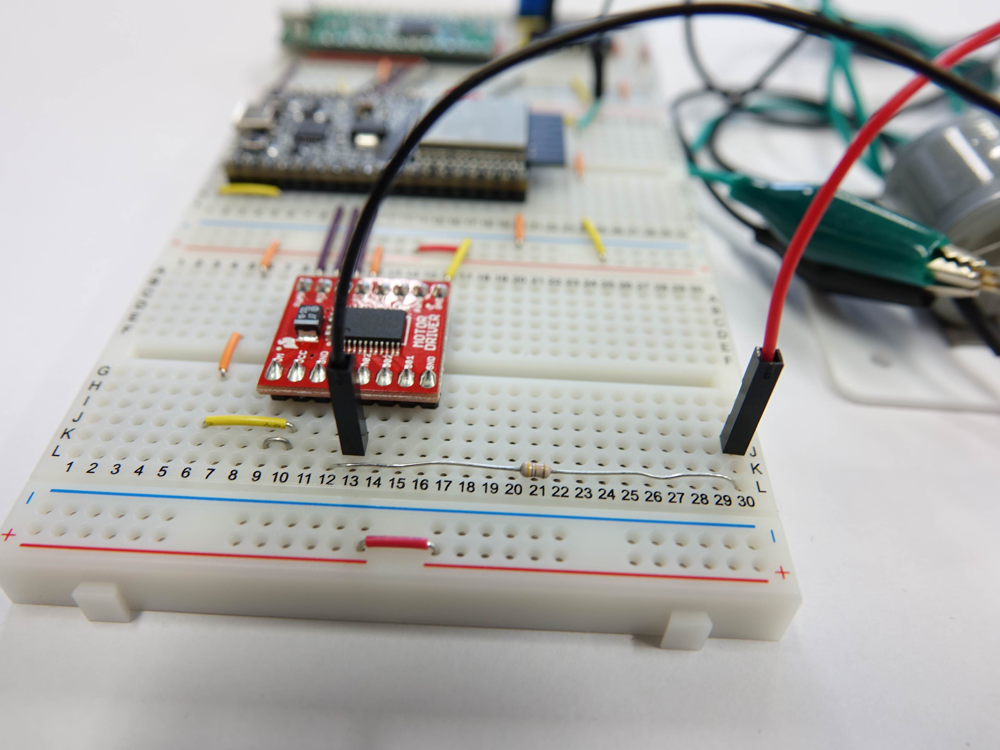

# 回路の制作
{: .no_toc }

1. TOC
{:toc}

## キットの受け取り

- 入口付近でキットを受け取ります(**箱1つと袋1つ**)。
- 箱と袋に養生テープ(白か緑)を貼り、ペンで**学籍番号と氏名**を書いてください。
  名前を書いたら実験室の棚に戻してもよいし、自宅で使いたければ持ち帰ってもかまいません。
- [部品一覧](../parts.html) で部品がそろっているか確認します。

## 作る回路

次の機能を持つ回路です。

- 感圧センサ(力センサ)の抵抗値の変化を OP アンプで増幅してから A/D 変換する。
- PWM 出力により、モータドライバを介してモータを駆動する。
- (デバッガを使う人のみ)JTAG 用のインタフェース(緑色の基板)を ESP32 マイコンボード(黒色の基板)に接続する。

多くの場合、箱には組み立て済みの回路が入っていますが、前の使用者が作り変えていることがあるので、
以下を見て確認・修正してください。

### 完成図



サンプルと、足りないもの(ハサミ、テープなど)は実験室の後ろに用意します。

### 回路図(入出力部のみ)

回路図は [こちら(gyazo)](https://gyazo.com/5b68e81bcd5d81f44d12dc210db5cfd0) にあります。

## 注意点

{: .warning }
**PC をつなぐ前に回路を確認してください。PC が破損しても補償できません。**
回路の電源は USB から供給されます。回路に間違いがある状態で PC の USB をつなぐと、PC が壊れることがあります。

1. PC に接続する前に、ESP32(真ん中のマイコン)にキット付属の AC アダプタをつなぎ、**熱くなる部品がない**ことを確認する。
2. モータの周辺、特に**モータと直列の 4.7 Ω の抵抗**が間違いなく入っていることを確認する。
3. モータのケーブルが他の部品と導通する可能性がないことを確認する。一瞬でも接触してショートすると PC が壊れることがあります。
   むき出しの配線はテープで絶縁してください。

{: .note }
AI は回路を見ることができません。回路の確認は人が行います。写真を撮って Gemini に「この配線は完成図と同じか」と
聞くのは補助としては有効ですが、最終確認は必ず自分の目で。

## 部分ごとの確認

### CMOS オペアンプ(NJU7044D)周辺




- **抵抗の色とブレッドボードに挿す位置**を間違えないように。抵抗1(19B と (+))、抵抗2(30A と (−))。
  色の読み方は [抵抗のカラーコード](http://www.jarl.org/Japanese/7_Technical/lib1/teikou.htm) を参照。
- **可変抵抗の種類と向き**に注意。キットに2種類入っていますが、**「T 103」**と書かれたものを使い、
  文字が書いてある面がブレッドボードの外側を向くように挿す。
- **20E と 21E を繋ぐジャンパー線**を忘れずに。
- センサをつなぐ緑と黒のケーブルは束ねてあるので、結束バンドをハサミで切ってください。

### ESP32 周辺



- **オレンジ色のジャンパー線**を忘れないように。

### モータードライバ周辺



- 抵抗の色と挿す位置を間違えないように。
- **9K と 10K を繋ぐジャンパー線**を忘れずに。

### モーター周辺の作り方

キットの中のモーター、圧力センサー、アクリル板を使います。

1. アクリル板の保護紙を剥がす。
2. セロハンテープでモーターに圧力センサーを貼り付ける。
3. 圧力センサーがモーターの真上にくるようにし、両面テープでモーターをアクリル板に貼り付ける。

{: .warning }
モータのケーブルと圧力センサは壊れやすいので注意して扱ってください。折れ曲がると断線して使えなくなります。

## 動作確認と可変抵抗の調整

[開発環境の準備](../setup.html) の 5 で ESP32 をブリッジにつないだら、ActiveHaptic を書き込みます。
AI に頼むか、ターミナルで次を実行します。

```sh
idf.py -C /content/work/ActiveHaptic build
esp flash /content/work/ActiveHaptic      # ブリッジのタブで「書き込む」を押す
esp log -f                               # Ctrl+C で止める
```

1秒に1回 `H_FUNC: ADC:1975` のように A/D 変換の値が表示されます。
この値が、**力センサを押していないときに 1600〜2000、押したときに 2500 程度**になるように、
可変抵抗(青い部品)を回して調節してください。

うまく調整できていれば、力センサを押すと `+` `-` が並び、**振動が出力されます**(モータは回転しません)。
`+` `-` は毎回の出力値が正か負かを表しています。モータの上の力センサを押して、
**クリック感**が感じられること、触感が変化することを確かめてください。

## 片付けと返却(最終回)

- ブレッドボードに刺さっている部品はそのままにしておく。
- 長いケーブル(ピンやミノムシクリップが付いているもの)はすべて外す。
- モータと力センサ、台の板はそのまま箱に戻す。
- [部品一覧](../parts.html) を見て部品がそろっていることを確認する。不足があればケースにテープを貼り、
  足りない部品と個数を書いて教員・TA の確認を受ける(例: 可変抵抗器 103 ×1、抵抗 1 kΩ ×2)。
