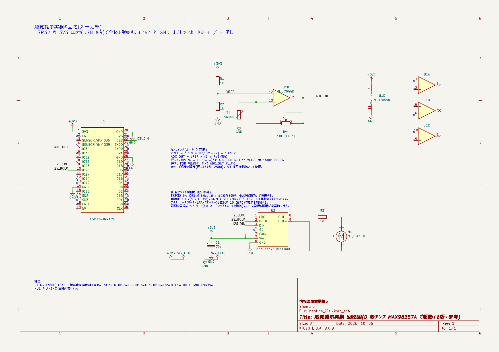

# D 級アンプ(MAX98357A)で駆動する(参考)
{: .no_toc }

標準の回路では、モータードライバ(TB6612FNG)に 1 kHz で波形を出しています。
**D 級アンプ MAX98357A**(Adafruit I2S 3W Class D Amplifier)を使うと、
ESP32 から音声と同じ I2S で **16 kHz の細かさ**で波形を送れるので、

- 1 kHz 近くまで波形がきれいに出せる(標準の回路は 250 Hz まで、きれいなのは 125 Hz くらいまで)
- 振動の立ち上がり・止まり方が滑らかになり、感触が良くなることが期待できる
- モータだけでなく、**LRA(リニア振動子)やスピーカー**もそのままつなげる

という利点があります。発展課題や自由制作の参考にしてください。

1. TOC
{:toc}

## 回路

[](../assets/img/circuit-schematic-i2s.png)

[PDF](https://github.com/hasevr/ICTEx5/raw/main/hardware/haptics-circuit/haptics_i2s.pdf) /
[KiCad のファイル](https://github.com/hasevr/ICTEx5/tree/main/hardware/haptics-circuit)(`haptics_i2s.kicad_sch`)

力センサとオペアンプの部分は標準の回路と同じです。モータードライバの代わりに MAX98357A をつなぎます。

| MAX98357A のピン | つなぐ先 |
|---|---|
| LRC | ESP32 の IO25 |
| BCLK | ESP32 の IO26 |
| DIN | ESP32 の IO22 |
| GAIN | Vin(利得 6 dB) |
| SD | つながない(基板上のプルアップのまま) |
| Vin | **+3V3**(5 V にしない) |
| GND | GND |
| 出力 + / − | 10 Ω の抵抗と直列に、アクチュエータ(モータ・LRA・スピーカー) |

電源の近くに 470 µF 程度の電解コンデンサを入れると、USB からの瞬間的な電流が抑えられます。
モータードライバはブレッドボードに挿したままでかまいません(ファームウェアが PWMA を Low にして止めます)。
ただし**モータの線は、モータードライバから外して D 級アンプ側につなぎ替えてください。**

{: .warning }
**電源は 3.3 V、直列の 10 Ω は必ず入れてください。** D 級アンプの出力は電源電圧までしか振れないので、
ソフトウェアがどんな値を出しても、電流は最悪で 3.3 V ÷(10 Ω + アクチュエータの抵抗)に収まります
(LRA(約 25 Ω)で約 94 mA、8 Ω のスピーカーで約 180 mA)。
5 V で給電したり抵抗を外したりすると、PC の USB ポートの上限(500 mA)を超えることがあります。

## ファームウェア

[`firmware/I2SHaptic`](https://github.com/hasevr/ICTEx5/tree/main/firmware/I2SHaptic)(ESP-IDF v5.5 のプロジェクト)

Colab では次のように取ってきて、ビルド・書き込みします。

```sh
cd /content/work && git clone -q https://github.com/hasevr/ICTEx5 ictex5 && cp -r ictex5/firmware/I2SHaptic .
idf.py -C /content/work/I2SHaptic build
esp flash /content/work/I2SHaptic
```

- 力センサの値で波形を始める考え方は ActiveHaptic(クリック)・SoftHaptics(柔らかさ)と同じで、`m` キーで切り替えます。
- 波形は減衰する cos 波 `A × cos(ωt) × exp(Bt)`。`w` キーで減衰する矩形波にもできます。
- キー操作(`esp send "f"` など): `f`/`F` 周波数(20〜2000 Hz)、`b`/`B` 減衰の強さ、`a`/`A` 振幅、`m` CLICK/SOFT、`w` 波形、`p` ヘルプ。
- 安全のため、出力は常にフルスケールの 60% 以下に制限しています(`AMP_LIMIT`)。

{: .note }
このファームウェアと回路は参考として用意したものです(ビルドは確認済み、実機での動作はまだ確かめていません)。
しきい値(`thresOn` など)は、標準の回路と同じく `esp log` の ADC の値を見て調整してください。
