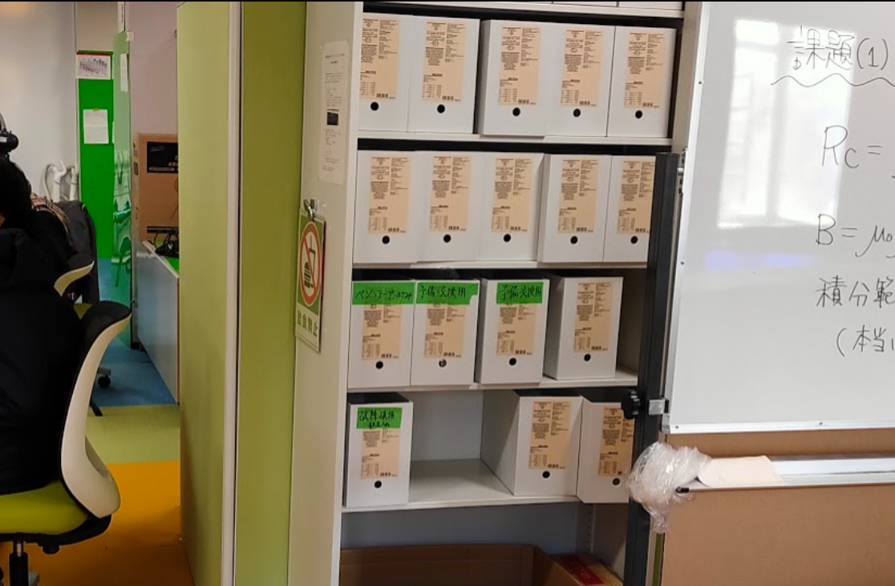
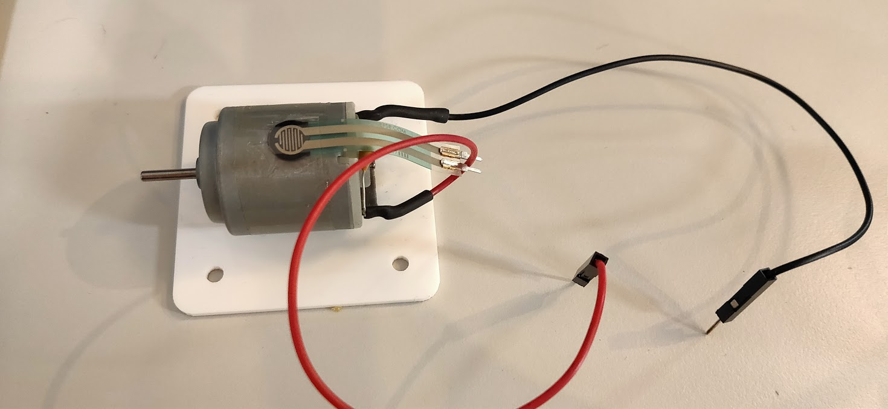
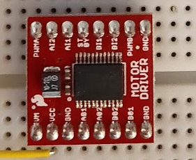
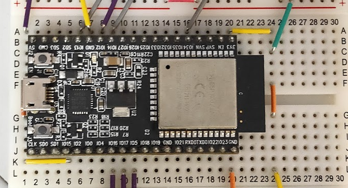
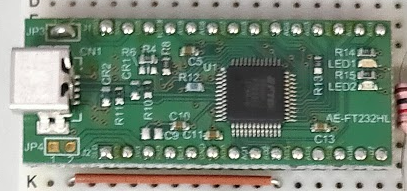
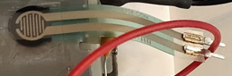
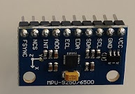
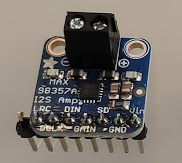
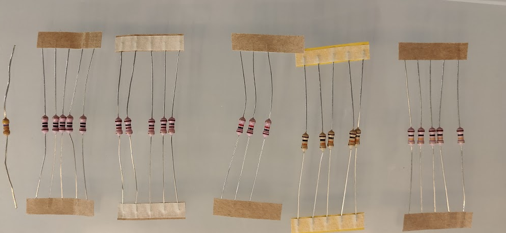

# 部品一覧
{: .no_toc }

実験キットを受け取ったら、以下の部品がそろっていることを確認してください。

- 抵抗・コンデンサなど複数あるものは、半数あれば問題ありません。
- 壊れやすい部品(力センサ・モータの端子)が壊れていないことも確認してください。
- ブレッドボードに刺さっているものもあります。[回路の制作](haptics/circuit.html) の完成図も参考にしてください。
- 実験中に部品の不足や故障に気づいたら、実験室の「予備・交換用」の箱から部品を取り、
  壊れた部品は「故障・破損部品入れ」に入れてください。

{: width="480" }

型番からデータシートを探すときは、AI に「この型番のデータシートの、ピン配置と電源電圧の部分を要約して」と頼むと早いです
(数値は必ずデータシート本体で確認してください)。

1. TOC
{:toc}

## ケース内

| 部品 | 個数 | 備考 |
|---|---|---|
| [モータ](https://www.switch-science.com/catalog/2736/) | 1 | 電線がとれていないこと、端子(ピン)が付いていることを確認。白いアクリル板に付いていなければ、スタッフから両面テープをもらって付ける |
| [スピーカー 8 Ω 8 W](http://akizukidenshi.com/catalog/g/gP-10984/) | 1 | |
| [TB6612FNG 搭載デュアルモータードライバ](https://www.switch-science.com/catalog/3586/) | 1 | |
| [ESP32-DevKitC(WROOM-32)](https://www.espressif.com/en/products/devkits/esp32-devkitc) | 1 | 黒い基板。マイコン本体 |
| [FT232HL](http://akizukidenshi.com/catalog/g/gK-06503/) | 1 | 緑の基板。デバッガ用 |
| [圧力センサ FSR400](http://akizukidenshi.com/catalog/g/gP-04003/)([データシート](https://cdn2.hubspot.net/hubfs/3899023/Interlinkelectronics%20November2017/Docs/Datasheet_FSR.pdf)) | 1 | モータに貼り付いている。足(ピン)が折れていないか、一部剥がれていないか確認 |
| [ブレッドボード 6 穴版 EIC-3901](http://akizukidenshi.com/catalog/g/gP-12366/) | 4 | |
| [ブレッドボードジャンプワイヤ](http://akizukidenshi.com/catalog/g/gP-00288/) | 1 | |
| [JP ワイヤー 10 cm(メス−メス)10 本入](https://www.marutsu.co.jp/pc/i/250279/) | 1 | |
| [ブレッドボード・ジャンパーワイヤ(オス−オス)](http://akizukidenshi.com/catalog/g/gC-05371/) | 1 | |
| [小型ミノムシクリップ付きケーブル 40 cm 5 本入](https://www.marutsu.co.jp/pc/i/594898/) | 1 | |
| [アクリル板](http://akizukidenshi.com/catalog/g/gP-12445/) | 1 | モータの土台 |
| [ケース](https://www.monotaro.com/p/1004/2191/) | 1 | |
| [フォトリフレクタ](http://akizukidenshi.com/catalog/g/gP-04500/) | 1 | |
| Raspberry Pi 3 Model B、SD カード | 1 | 後半の協調動作実験で使う |
| [MPU-9250 9 軸センサ](https://invensense.tdk.com/products/motion-tracking/9-axis/mpu-9250/) | 1 | 加速度・ジャイロ・地磁気 |
| [Adafruit I2S 3W Class D Amplifier(MAX98357A)](https://www.adafruit.com/product/3006) | 1 | |

## ケース内の袋

| 部品 | 個数 | 備考 |
|---|---|---|
| [NJU7044D 4ch OP アンプ](https://www.njr.co.jp/products/semicon/products/NJU7044.html) | 1 | |
| [エレクトレットコンデンサーマイクロホン](http://akizukidenshi.com/catalog/g/gP-08182/) | 1 | |
| 抵抗 4.7 Ω | 1 | 黄紫金金 |
| 抵抗 10 Ω 1/2 W | 5 | 茶黒黒金 |
| 抵抗 100 Ω 1/2 W | 5 | 茶黒茶金 |
| 抵抗 1 kΩ 1/2 W | 5 | 茶黒赤金 |
| 抵抗 10 kΩ 1/4 W | 5 | 茶黒橙金 |
| 抵抗 100 kΩ 1/4 W | 5 | 茶黒黄金 |
| [コンデンサ 0.1 µF 50 V](http://akizukidenshi.com/catalog/g/gP-00090/) | 5 | |
| [コンデンサ 1 µF 50 V](http://akizukidenshi.com/catalog/g/gP-03093/) | 5 | |
| [コンデンサ 10 µF 25 V](http://akizukidenshi.com/catalog/g/gP-03095/) | 5 | |
| [電解コンデンサ 470 µF 16 V](http://akizukidenshi.com/catalog/g/gP-08426/) | 2 | |
| [半固定ボリューム 1 kΩ [102]](http://akizukidenshi.com/catalog/g/gP-08011/) | 2 | |
| [半固定ボリューム 10 kΩ [103]](http://akizukidenshi.com/catalog/g/gP-08012/) | 2 | 回路で使うのはこちら(「T 103」) |

{: width="480" }

## ケーブルの入ったビニール袋

| 部品 | 個数 |
|---|---|
| [マイクロ USB ケーブル](http://akizukidenshi.com/catalog/g/gC-07607/) | 1 |
| [ミニ USB ケーブル](http://akizukidenshi.com/catalog/g/gC-07606/) | 1 |
| USB ハブ | 1 |
| [5 V 3 A USB 電源](http://akizukidenshi.com/catalog/g/gM-12001/) | 1 |
| HDMI-DVI ケーブル 1.8 m | 1 |
| ネットワークケーブル CAT6 | 1 |
